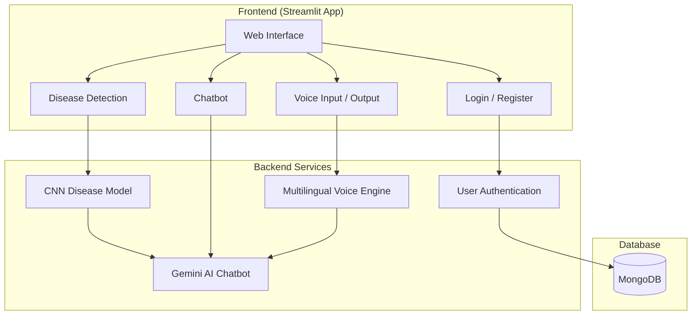
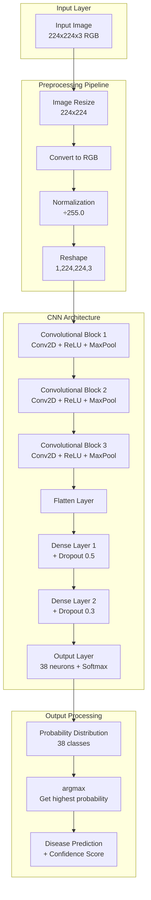
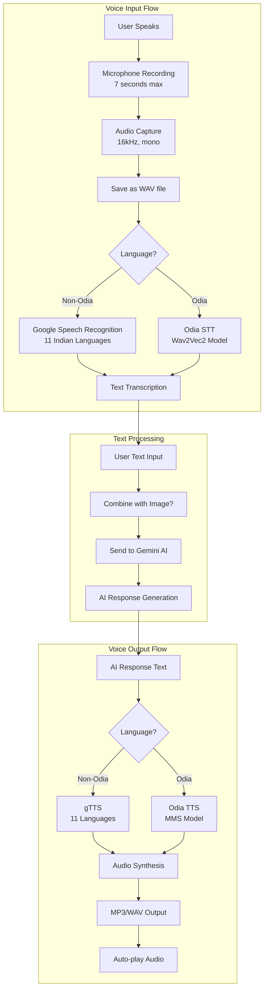

# AgriVoice 🌿

## Project Overview
AgriVoice is an AI-powered plant disease detection system with multilingual voice support, designed to help farmers identify crop diseases and get expert agricultural advice through an intelligent chatbot.

---

## 1. Dataset Description

### Dataset Overview
The model is trained on a comprehensive plant disease dataset covering **38 different disease classes** across **14 plant species**.

**Dataset Statistics:**
- 📊 **Total Classes**: 38 (including healthy plants)
- 🌱 **Plant Species**: 14 types
- 🖼️ **Image Resolution**: 224×224 pixels (RGB)
- 🎯 **Disease Categories**: Fungal, Bacterial, Viral infections

### Supported Plant Species & Diseases

#### 🍎 **Apple** (4 classes)
- Apple Scab
- Black Rot
- Cedar Apple Rust
- Healthy

#### 🫐 **Blueberry** (1 class)
- Healthy

#### 🍒 **Cherry** (2 classes)
- Powdery Mildew
- Healthy

#### 🌽 **Corn (Maize)** (4 classes)
- Cercospora Leaf Spot / Gray Leaf Spot
- Common Rust
- Northern Leaf Blight
- Healthy

#### 🍇 **Grape** (4 classes)
- Black Rot
- Esca (Black Measles)
- Leaf Blight (Isariopsis Leaf Spot)
- Healthy

#### 🍊 **Orange** (1 class)
- Huanglongbing (Citrus Greening)

#### 🍑 **Peach** (2 classes)
- Bacterial Spot
- Healthy

#### 🌶️ **Pepper (Bell)** (2 classes)
- Bacterial Spot
- Healthy

#### 🥔 **Potato** (3 classes)
- Early Blight
- Late Blight
- Healthy

#### 🍓 **Raspberry** (1 class)
- Healthy

#### 🫘 **Soybean** (1 class)
- Healthy

#### 🎃 **Squash** (1 class)
- Powdery Mildew

#### 🍓 **Strawberry** (2 classes)
- Leaf Scorch
- Healthy

#### 🍅 **Tomato** (10 classes)
- Bacterial Spot
- Early Blight
- Late Blight
- Leaf Mold
- Septoria Leaf Spot
- Spider Mites (Two-spotted Spider Mite)
- Target Spot
- Tomato Yellow Leaf Curl Virus
- Tomato Mosaic Virus
- Healthy

### Disease Types Coverage
- 🦠 **Bacterial Diseases**: Bacterial Spot (Apple, Peach, Pepper, Tomato)
- 🍄 **Fungal Diseases**: Scab, Rust, Blight, Mildew, Mold, Rot
- 🦟 **Viral Diseases**: Mosaic Virus, Leaf Curl Virus, Citrus Greening
- 🕷️ **Pest Damage**: Spider Mites

---

## 2. Overall Application Architecture

---

## 3. CNN Model Architecture

**Model Specifications:**
- **Input Shape**: 224 × 224 × 3 (RGB images)
- **Model Type**: Sequential CNN (Keras)
- **Total Classes**: 38 plant disease categories
- **Activation Functions**: ReLU (hidden layers), Softmax (output layer)
- **Regularization**: Dropout layers (0.5 and 0.3)
- **Output**: Disease class label with confidence score

---

## 4. Voice Processing Pipeline

---

## Key Technologies Used

### Core Frameworks
- **Streamlit**: Web application framework
- **TensorFlow/Keras**: Deep learning model
- **PyMongo**: MongoDB integration
- **LangChain**: AI chatbot framework

### AI & ML Models
- **Google Gemini 2.5 Flash**: Conversational AI
- **Pre-trained CNN**: Plant disease detection
- **Wav2Vec2**: Speech-to-text for Odia
- **MMS-TTS**: Text-to-speech for Odia

### Audio Processing
- **sounddevice**: Audio recording
- **soundfile**: Audio file handling
- **librosa**: Audio analysis
- **gTTS**: Text-to-speech (11 languages)
- **SpeechRecognition**: Speech-to-text

### Security & Storage
- **bcrypt**: Password hashing
- **MongoDB**: User database
- **python-dotenv**: Environment variables

---

## Supported Languages (12)
🌐 English, Hindi, Marathi, Tamil, Telugu, Bengali, Gujarati, Odia, Punjabi, Urdu, Malayalam, Kannada

---

## Features
✅ User authentication with mobile number  
✅ Plant disease detection (38 classes)  
✅ Multilingual voice chat (12 Indian languages)  
✅ AI-powered agricultural chatbot  
✅ Image-based disease analysis  
✅ Text-to-speech in native languages  
✅ Real-time voice recording  
✅ Session-based chat history (clears on logout/refresh)  

---

**Developed by:**
* Suraj Kumar Yadav
* Om Prakash

